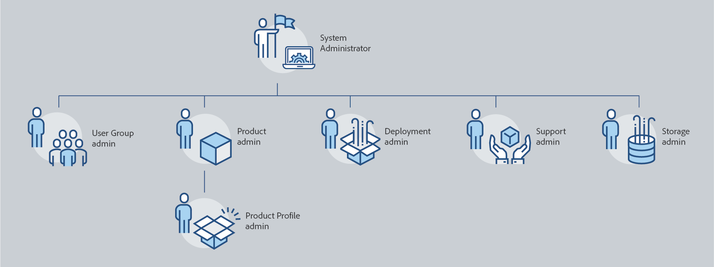
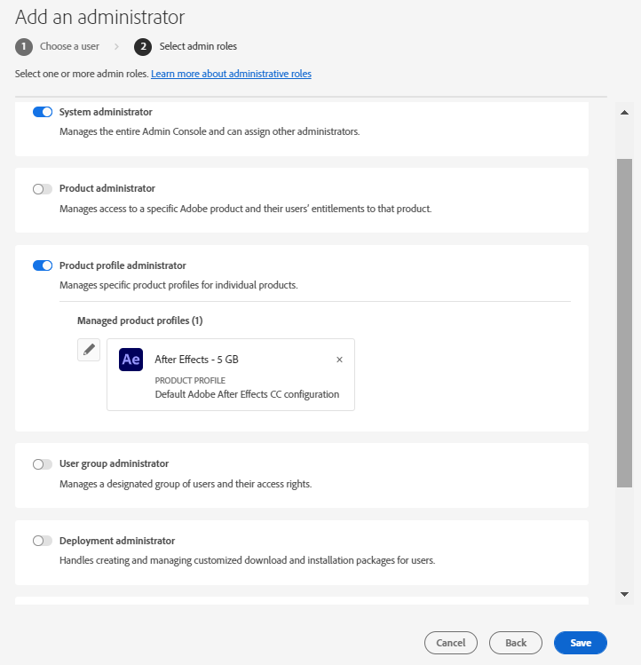

# Administratieve rollen

Met de Adobe Admin Console kunnen organisaties een flexibele beheershiërarchie definiëren die fijngeoriënteerd beheer van de toegang tot en het gebruik van Adobe-producten mogelijk maakt. Één of meerdere beheerders van het Systeem, die tijdens het ondernemings op instapniveau proces worden voorzien, zitten bij de bovenkant van de hiërarchie. Deze beheerders van het Systeem kunnen verantwoordelijkheden aan andere beheerders delegeren, terwijl het behouden van algemene controle.

De administratieve Rollen verstrekken de volgende belangrijkste voordelen aan ondernemingen:

* Gecontroleerde decentralisatie van administratieve verantwoordelijkheden
* Snelle weergave van producttoewijzingen—per gebruiker en per product
* Functionaliteit om quota toe te wijzen aan productbeheerders

## Administratieve hiërarchie

Van toepassing op: Adobe-zakelijke klanten.

De beheerhiërarchie kan worden gebruikt om aan de unieke vereisten van uw onderneming te voldoen. Een onderneming kan bijvoorbeeld verschillende beheerders aanwijzen om rechten op Adobe Creative Cloud- en Adobe Marketing Cloud-aanbiedingen te beheren. Een onderneming kan ook verschillende beheerders hebben om rechten te beheren van gebruikers die tot verschillende bedrijfseenheden behoren.

>[!NOTE]
>
>De beheerhiërarchie is niet van toepassing op teamklanten. Teams klanten hebben één **Systeembeheerder** rol. De eigenaar van het contract (_voorheen **Primaire beheerder**&#x200B;_) is de systeembeheerder met toegang tot de contractdetails en de factureringsgeschiedenis. Als u de huidige contracteigenaar bent, kunt u een bestaande systeembeheerder aanwijzen (_ voorheen **secundaire beheerder**&#x200B;_) als de eigenaar van het contract.

_Hiërarchie van beheerrollen_

| Rol | Beschrijving |
|--- |--- |
| **Systeembeheerder** | Supergebruiker voor de organisatie; mag alle beheertaken in de Admin Console uitvoeren. Heeft ook machtigingen om de volgende beheerfunctionaliteit te delegeren aan andere gebruikers: Beheer van productprofielen, beheer van productprofielen, beheer van gebruikersgroepen, implementatiebeheer en supportbeheerder. |
| **Productbeheerder** | beheert de aan die beheerder toegewezen producten en alle bijbehorende administratieve functies, waaronder:<ul><li>Productprofielen maken</li><li>Gebruikers en gebruikersgroepen toevoegen aan de organisatie, maar deze niet verwijderen</li><li>Gebruikers en gebruikersgroepen toevoegen aan of verwijderen uit productprofielen</li><li>Beheer van productprofielen toevoegen aan of verwijderen uit productprofielen</li><li>Andere productbeheerders toevoegen aan of verwijderen uit het product</li><li>Groepbeheerders toevoegen aan of verwijderen uit groepen</li></ul> |
| **Beheerder productprofiel** | Hiermee beheert u de beschrijvingen van het productprofiel die aan die beheerder zijn toegewezen en alle bijbehorende beheerfuncties, waaronder:<ul><li>Gebruikers en gebruikersgroepen toevoegen aan de organisatie, maar deze niet verwijderen</li><li>Gebruikers en gebruikersgroepen toevoegen aan of verwijderen uit productprofielen</li><li>Productmachtigingen aan gebruikers en gebruikersgroepen toewijzen of intrekken vanuit productprofielen</li><li>Productrollen van gebruikers en gebruikersgroepen beheren voor productprofielen |
| **Gebruikersgroepbeheer** | Hiermee beheert u de beschrijvingen van de gebruikersgroepen die aan die beheerder zijn toegewezen en alle bijbehorende beheerfuncties, waaronder:<ul><li>Gebruikers toevoegen aan of verwijderen uit groepen</li><li>Gebruikersgroepbeheerders toevoegen aan of verwijderen uit groepen |
| **Implementatiebeheer** | Maakt, beheert en implementeert softwarepakketten en updates voor eindgebruikers. |
| **Ondersteuningsbeheerder** | Niet-administratieve rol die toegang tot op steun betrekking hebbende informatie, zoals klant-gemelde uitgifterapporten heeft. |
| **Opslagbeheerder** | Beheert het opslagbeheer van de organisatie. De beheerder kan het opslagverbruik van zowel actieve als inactieve gebruikers bekijken en inhoud overbrengen naar andere ontvangers. |

Voor een gedetailleerde lijst van toestemmingen en voorrechten voor elke adminrol, zie [Machtigingen](#enterprise-admins-permissions-matrix).

## Een beheerdersrol voor ondernemingen toevoegen {#add-enterprise-role}

Van toepassing op: Adobe-zakelijke klanten.

Als beheerder kunt u een beheerdersrol toewijzen aan andere gebruikers, zodat deze dezelfde rechten krijgen als u hebt, of rechten voor een rol onder uw beheerdersrol in de hiërarchie, zoals beschreven [boven](#administrative-hierarchy). Als productbeheerder kunt u bijvoorbeeld bevoegdheden voor productbeheer of productprofielbeheer aan een gebruiker geven, maar geen rechten voor implementatiebeheer. Voor de toestemmingen op de Admin Console, zie [Machtigingenmatrix](#enterprise-admins-permissions-matrix).

Een beheerder toevoegen of uitnodigen:

1. In de [Admin Console](https://adminconsole.adobe.com/)kiest u **Gebruikers** > **Beheerders**.

   U kunt ook naar het desbetreffende product, productprofiel of gebruikersgroep gaan en naar de **Admins** tab.

1. Klikken **Admin toevoegen**.
1. Voer een naam of e-mailadres in. U kunt zoeken naar bestaande gebruikers of een nieuwe gebruiker toevoegen door een geldig e-mailadres op te geven en de gegevens op het scherm in te vullen.
1. Klikken **Volgende**. Er wordt een lijst met beheerrollen weergegeven.

>[!NOTE]
>
>* De opties op dit scherm zijn afhankelijk van uw account- en beheerdersrol. U kunt of de zelfde voorrechten geven zoals u hebt, of voorrechten voor een rol onder u in de hiërarchie.
>* Als Systeembeheerder van een team kunt u slechts één beheerdersrol toewijzen: Systeembeheerder.

1. Selecteer een of meer beheerrollen.
1. Selecteer voor beheertypen zoals Productbeheerder, Productprofielbeheerder en Gebruikersgroepbeheerder de specifieke producten, profielen en groepen.

>[!NOTE]
>
>Voor een beheerder van het Profiel van het Product, kunt u profielen voor meer dan één product omvatten.

1. Controleer de beheerdersrollen die aan de gebruiker zijn toegewezen en klik op **Opslaan**.

De gebruiker ontvangt een e-mailuitnodiging met betrekking tot de nieuwe beheerdersrechten van `message@adobe.com`.

Gebruikers moeten klikken **Aan de slag** in de e-mail om lid te worden van de organisatie. Als nieuwe beheerders de **Aan de slag** in de e-mailuitnodiging. Ze kunnen zich dan niet aanmelden bij de Admin Console.

Als onderdeel van het aanmeldingsproces kunnen gebruikers worden gevraagd een Adobe-profiel in te stellen als ze dat nog niet hebben. Als gebruikers meerdere profielen hebben die zijn gekoppeld aan hun e-mailadres, moeten gebruikers de optie &quot;Deelnemen aan team&quot; kiezen (indien gevraagd) en vervolgens het profiel selecteren dat is gekoppeld aan de nieuwe organisatie.

## Teambeheerder toevoegen {#add-admin-teams}

Van toepassing op: Adobe teams klanten.

Als beheerder, kunt u de rol van de Beheerder van het Systeem aan andere gebruikers toewijzen, die hen de zelfde voorrechten geven zoals u hebt.

Een systeembeheerder toevoegen of uitnodigen:

1. Kies in de Admin Console de optie **Gebruikers** > **Beheerders**.

   Er wordt een lijst met bestaande beheerders weergegeven.

1. Klikken **Admin toevoegen**.

   De **Beheerder toevoegen** weergegeven.

1. Voer een naam of e-mailadres in. U kunt zoeken naar bestaande gebruikers of een nieuwe gebruiker toevoegen door een geldig e-mailadres op te geven en de gegevens op het scherm in te vullen.

   Systeembeheerder is standaard geselecteerd.

1. Klikken **Opslaan**.

Aangezien alle gebruikers in een teamorganisatie gebruikers van bedrijfs-id zijn, ontvangen zij een e-mailuitnodiging betreffende de nieuwe administratieve voorrechten van `message@adobe.com`.
Gebruikers moeten in de e-mail op Aan de slag klikken om lid te worden van de organisatie.

Als onderdeel van het aanmeldingsproces kunnen gebruikers worden gevraagd een Adobe-profiel in te stellen als ze dat nog niet hebben. Als gebruikers meerdere profielen hebben die zijn gekoppeld aan hun e-mailadres, moeten gebruikers de optie &quot;Deelnemen aan team&quot; kiezen (indien gevraagd) en vervolgens het profiel selecteren dat is gekoppeld aan de nieuwe organisatie.

## Beheerdersrol voor ondernemingen bewerken

Van toepassing op: Adobe-zakelijke klanten.

Als beheerder, kunt u de admin rol aan andere admin uitgeven die onder u in de Administratieve hiërarchie zijn. U kunt bijvoorbeeld de beheerdersrechten van andere beheerders verwijderen.

Beheerdersrollen bewerken:

1. Kies in de Admin Console de optie **Gebruikers** > **Beheerders**. De lijst met bestaande beheerders wordt weergegeven.

   U kunt ook naar het desbetreffende product, productprofiel of gebruikersgroep gaan en naar de **Admins** tab.

1. Klik op de naam van de beheerder die u wilt bewerken.
1. In de **Gebruikersgegevens**, klikt u op  voor de **Administratieve rechten** en kiest u **Beheerdersrechten bewerken**.

   

1. Bewerk de beheerrechten en sla uw wijzigingen op.

## Teambeheerder-rol bewerken

Van toepassing op: Adobe teams klanten.

Als beheerder van het Systeem van teams, kunt u de adminvoorrechten van het Systeem van andere admins verwijderen.

Systeembeheerdersrechten intrekken:

1. Kies in de Admin Console de optie **Gebruikers** > **Beheerders**.

   De lijst met bestaande beheerders wordt weergegeven.

1. Klik in de gebruikersgegevens op  rechts van de **Administratieve rechten** en kiest u **Beheerdersrechten bewerken**.

   

1. Bewerk de beheerrechten en sla uw wijzigingen op.

## Admin verwijderen

Van toepassing op: Adobe teams bedrijfsklanten.

1. Als u beheerdersmachtigingen wilt intrekken, selecteert u een gebruiker en klikt u op **Admin verwijderen**.

>[!NOTE]
>
>Als u een beheerder verwijdert, wordt de gebruiker niet uit de Admin Console verwijderd, maar worden alleen de aan de beheerdersrol gekoppelde rechten verwijderd.

## Matrix met machtigingen voor Enterprise-beheerders

Van toepassing op: Adobe-zakelijke klanten.

In de volgende tabel worden alle machtigingen voor de verschillende typen beheerders weergegeven, gecategoriseerd op basis van de volgende functiegebieden:

### Identiteitsbeheer

| Machtiging | Systeembeheerder | Ondersteuningsbeheer |
|--- |--- |--- |
| Domein toevoegen (een domein aanvragen/aanvragen) | ✔ |  |
| Domein- en domeinlijst weergeven | ✔ |  |
| Domeincoderingssleutels beheren | ✔ |  |
| Standaardbeleid voor wachtwoorden van org beheren | ✔ |  |
| Standaardbeleid voor org-wachtwoorden weergeven | ✔ |  |

### Gebruikersbeheer

| Machtiging | Systeembeheerder | Ondersteuningsbeheer |
|--- |--- |--- |
| Gebruiker toevoegen aan org | ✔ |  |
| Gebruiker verwijderen van org | ✔ |  |
| Gebruikersgegevens en aanbieding weergeven | ✔ |  |
| Gebruikersprofiel bewerken | ✔ |  |
| Productprofiel toevoegen aan gebruiker of groep | ✔ |  |
| Productprofiel verwijderen voor gebruiker of groep | ✔ |  |
| Productprofiel toevoegen aan meerdere gebruikers | ✔ |  |
| Productprofielen voor een gebruiker weergeven | ✔ |  |
| Aanbieding van productgebruikers weergeven | ✔ |  |
| Gebruikers aan org toevoegen met opsommingsteken | ✔ |  |

### Beheerderbeheer

| Machtiging | Systeembeheerder | Ondersteuningsbeheer |
|--- |--- |--- |
| Org Admin aan een gebruiker verlenen | ✔ |  |
| Org Admin van een gebruiker intrekken | ✔ |  |
| Licentiebeheer aan een gebruiker verlenen | ✔ |  |
| Licentiebeheerder van een gebruiker intrekken | ✔ |  |
| Implementatiebeheerder aan een gebruiker verlenen | ✔ |  |
| Implementatiebeheerder van een gebruiker intrekken | ✔ |  |
| Gebruikersgroepbeheer aan een gebruiker toekennen | ✔ |  |
| Gebruikersgroepbeheer van een gebruiker intrekken | ✔ |  |
| Beheer van de eigenaar van het product aan een gebruiker toekennen | ✔ |  |
| Admin van eigenaar van product van gebruiker intrekken | ✔ |  |

### Configuratiebeheer van productlicenties

| Machtiging | Systeembeheerder | Ondersteuningsbeheer |
|--- |--- |--- |
| Toekennen van productrechten aan org |  |  |
| Productmachtigingen verwijderen van org |  |  |
| Het totale aantal licenties van de org weergeven | ✔ |  |
| Beschikbare producten en productfamilies weergeven | ✔ |  |
| Beschrijvingen/gegevens van productlicenties bewerken | ✔ |  |
| Productlicentie aan een gebruiker verstrekken | ✔ |  |
| Productlicentie van een gebruiker deprovisioneren | ✔ |  |
| Nieuwe productlicentieconfiguratie toevoegen | ✔ |  |
| Configuratie van productlicentieservice bewerken | ✔ |  |
| Productlicentieserviceconfiguratie verwijderen | ✔ |  |
| Producttoegang van een gebruiker verwijderen (strip uit alle configuraties) | ✔ |  |

### Opslagbeheer

| Machtiging | Systeembeheerder | Ondersteuningsbeheer |
|--- |--- |--- |
| Actieve en Inactieve gebruikersmappen weergeven | ✔ |  |
| Inactieve gebruikersmappen en overdrachtsinhoud verwijderen | ✔ |  |

### Implementatie

| Machtiging | Systeembeheerder | Ondersteuningsbeheer |
|--- |--- |--- |
| Het tabblad Pakketten weergeven/gebruiken | ✔ |  |

### Ondersteuning

| Machtiging | Systeembeheerder | Ondersteuningsbeheer |
|--- |--- |--- |
| Tabblad Ondersteuning weergeven | ✔ |  |
| Ondersteuningsgevallen beheren | ✔ | ✔ |

### Gebruikersgroepbeheer

| Machtiging | Systeembeheerder | Ondersteuningsbeheer |
|--- |--- |--- |
| Gebruikersgroep maken | ✔ |  |
| Gebruikersgroep verwijderen | ✔ |  |
| Gebruiker toevoegen aan gebruikersgroep | ✔ |  |
| Gebruiker uit gebruikersgroep verwijderen | ✔ |  |
| Gebruikersgroep toewijzen aan productlicentie | ✔ |  |
| Gebruikersgroep verwijderen uit productlicentie | ✔ |  |
| Lid van gebruikersgroep weergeven | ✔ | ✔ |
| Lijst met gebruikersgroepen weergeven | ✔ | ✔ |
