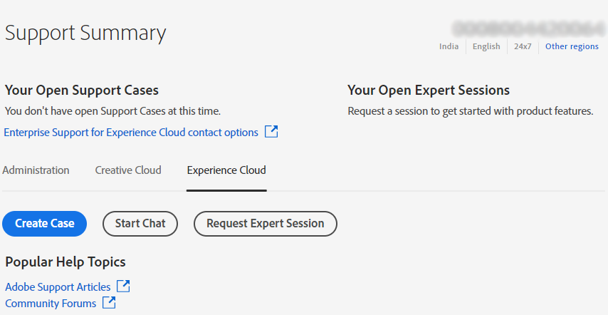

# Ondernemingen en teams | Contact opnemen met de Adobe Klantenservice

Navigeer naar de Adobe Klantenservice om contact op te nemen **Ondersteuning** in de [Admin Console](https://adminconsole.adobe.com/).

De **Het tabblad Ondersteuning** in de [Admin Console](https://adminconsole.adobe.com/) biedt u toegang tot verschillende ondersteuningsopties via een eenvoudige en gebruiksvriendelijke interface. Welke opties beschikbaar zijn op het tabblad Ondersteuning, is afhankelijk van uw abonnementsplan. Klik voor meer informatie op **Meer informatie** komt overeen met uw abonnementsplan.

Als u niet zeker bent van uw abonnementsplan, navigeer naar **Het tabblad Ondersteuning** op de [Admin Console](https://adminconsole.adobe.com/)en vergelijk uw weergave met de onderstaande afbeeldingen. Klik vervolgens op het bijbehorende **Meer informatie** koppeling.

## Voor teamaccount

[Meer informatie](https://helpx.adobe.com/enterprise/using/support-for-teams.html)

## Voor ondernemingsrekening

[Meer informatie](https://helpx.adobe.com/enterprise/using/support-for-enterprise.html)

## Voor Experience Cloud

[Meer informatie](https://www.adobe.com/go/ac_ec_not_supported_en)
