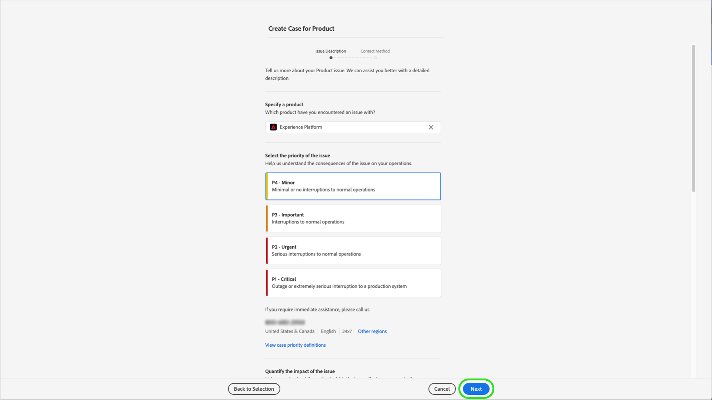

# Adobe Klantenondersteuning

## Tickets voor ondersteuning van Admin Consoles

Ondersteuningstaarten kunnen nu worden verzonden via de [Admin Console](https://adminconsole.adobe.com/). Voor instructies over hoe te om een steunkaartje voor te leggen, herzie de sectie voor [het indienen van een steunkaartje](#submit-ticket).

We werken eraan om de interactie met de klantenondersteuning van Adobe te verbeteren. Onze visie is om de supportervaring te stroomlijnen door over te stappen naar één toegangspunt, met de Adobe Admin Console. Uw organisatie heeft eenvoudig toegang tot de Adobe Klantenondersteuning. een groter zicht in uw de dienstgeschiedenis door een gemeenschappelijk systeem over producten te hebben; en vraag hulp via telefoon, Web, en praatje door één enkel portaal.

## Hoe te om een Admin Console steunkaartje voor te leggen {#submit-ticket}

Om een ondersteuningsticket in te dienen [Admin Console](https://adminconsole.adobe.com/), moet u de rol van Admin van de Steun hebben die door een Beheerder van het Systeem wordt toegewezen. Alleen een systeembeheerder in uw organisatie kan deze rol toewijzen. Het product, het Profiel van het Product, en andere administratieve rollen kunnen niet de de adminrol van de Steun toewijzen en kunnen niet bekijken **[!UICONTROL Create Case]** optie gebruikt om een steunkaartje voor te leggen. Ga voor meer informatie naar de [klantenservice voor bedrijven en teams](https://helpx.adobe.com/enterprise/using/support-and-expert-services.html) documentatie.

### Wijs de rol van beheerder van de Steun toe

De rol van steunbeheerder is een niet administratieve rol die toegang tot steun-verwante informatie heeft. Ondersteuningsbeheerders kunnen probleemrapporten weergeven, maken en beheren.

Om de rol van beheerder van de Steun toe te wijzen, volg [de beheerdersrol voor ondernemingen bewerken](https://helpx.adobe.com/enterprise/using/admin-roles.html#add-admin-teams) instructies in de documentatie met administratieve rollen. Merk op dat slechts een systeembeheerder voor uw organisatie deze rol kan toewijzen. Ga voor meer informatie over de beheershiërarchie naar de [administratieve taken](https://helpx.adobe.com/enterprise/admin-guide.html/enterprise/using/admin-roles.ug.html) documentatie.

### Een ondersteuningsticket maken met Admin Console

Een ticket maken met [Admin Console](https://adminconsole.adobe.com/), selecteert u de **[!UICONTROL Support]** in de bovenste navigatie. De [!UICONTROL Support Summary] wordt weergegeven. Selecteer vervolgens de **[!UICONTROL Create Case]** optie.

>[!TIP]
>
> Als u de **[!UICONTROL Create Case]** of de **[!UICONTROL Support]** moet u contact opnemen met een systeembeheerder om de rol Support-beheerder toe te wijzen.

Er wordt een dialoogvenster weergegeven waarin u een type uitgave kunt selecteren. Selecteer het type probleem dat het beste uw probleem of vraag beschrijft en selecteer **[!UICONTROL Create Case]** rechtsonder.

De **[!UICONTROL Create Case]** wordt weergegeven. U wordt gevraagd om bepaalde informatie zoals het product, de prioriteit, de beschrijving te verstrekken, en om het even welke screenshots bij te voegen helpen de kwestie beschrijven. Selecteren **[!UICONTROL Next]** om door te gaan.

>[!NOTE]
>
> Als de kwestie in stroomonderbrekingen of zeer ernstige onderbrekingen van een productiesysteem resulteert, wordt een telefoonaantal verstrekt voor directe hulp.

Op de volgende pagina kunt u de contactgegevens invullen en de beste tijd bieden voor Adobe Klantenondersteuning om contact met u op te nemen. Selecteer **[!UICONTROL Submit]** rechtsonder en uw ticket wordt naar de klantenondersteuning van Adobe verzonden.

<!--

## What About the Legacy Systems?

New Tickets/Cases will no longer be able to be submitted in legacy systems as of May 11th.  The [Admin Console](https://adminconsole.adobe.com/) will be used to submit new tickets/cases.

### Existing Tickets/Cases

* Between May 11th and May 20th the legacy systems will remain available to work existing tickets/cases to completion.
* Beginning May 20th the support team will migrate remaining open cases from the legacy systems to the new support experience.  You will receive an email notification regarding how to contact support to continue to work these cases.
-->
